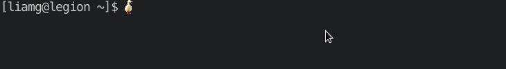

# Darktile

Darktile is a GPU rendered terminal emulator designed for tiling window managers. 


## Features

- GPU rendering
- Unicode support
- Variety of themes available (or build your own!)
- Compiled-in powerline font
- Works with your favourite monospaced TTF/OTF fonts
- Font ligatures (turn it off if you're not a ligature fan)
- Hints: Context-aware overlays e.g. hex colour viewer, octal permission annotation
- Take screenshots with a single key-binding
- Sixels
- Window transparency (0-100%)
- Customisable cursor (most popular image formats supported)

<p align="center">

</p>

## Installation

Install dependencies:

- `xorg-dev`
- `libgl1-mesa-dev`

Grab a binary from the [latest release](https://github.com/liamg/darktile/releases/latest), `chmod +x` it and place it in your `$PATH`.

If you're too lazy to do the above and you like to live life on the edge, you can pipe this script to sudo:

```bash
curl -s "https://raw.githubusercontent.com/liamg/darktile/main/scripts/install.sh" | sudo bash
```

## Configuration

Configuration files should be created in `$XDG_CONFIG_HOME/darktile/` if the variable is defined, otherwise in `$HOME/.config/darktile/`. 

If you wish, you can create an example config file as a starting point using `darktile --rewrite-config`.

Darktile will use sensible defaults if no config/theme files are available. The same applies when you omit settings from config/theme files, meaning it is perfectly valid to start with empty config/theme files and add to them as required to override the default behaviour.

### Config File

Found in the config directory (see above) inside `config.yaml`.

```yaml
opacity: 1.0       # Window opacity: 0.0 is fully transparent, 1.0 is fully opaque
font:
  family: ""       # Font family. Find possible values for this by running 'darktile list-fonts'
  size: 16         # Font size
  dpi: 72          # DPI
  ligatures: true  # Enable font ligatures e.g. render '≡' instead of '==='
cursor:
  image: ""        # Path to an image to render as your cursor (defaults to standard rectangular cursor)
```

### Example Theme

Found in the config directory (see above) inside `theme.yaml`. You can replace this file with a symlink or any theme file from [darktile-themes](https://github.com/liamg/darktile-themes).


```yaml
black: '#1d1f21'
red: '#cc6666'
green: '#b5bd68'
yellow: '#f0c674'
blue: '#81a2be'
magenta: '#b294bb'
cyan: '#8abeb7'
white: '#c5c8c6'
brightblack: '#666666'
brightred: '#d54e53'
brightgreen: '#b9ca4a'
brightyellow: '#e7c547'
brightblue: '#7aa6da'
brightmagenta: '#c397d8'
brightcyan: '#70c0b1'
brightwhite: '#eaeaea'
background: '#1d1f21'
foreground: '#c5c8c6'
selectionbackground: '#aa8800'
selectionforeground: '#ffffff'
cursorforeground: '#1d1f21'
cursorbackground: '#c5c8c6'
```

## Key Bindings

| Action                      | Binding |
|-----------------------------|---------|
| Copy               | `ctrl + shift + C`
| Paste              | `ctrl + shift + V`
| Decrease font size | `ctrl + -`
| Increase font size | `ctrl + =`
| Take screenshot    | `ctrl + shift + [`
| Open URL           | `ctrl + click`

## FAQ

### What happened to Aminal?

The name changed as a result of a near-complete rewrite of Aminal. Also, Google's "did you mean animal?" was getting pretty annoying.

### Did Darktile drop Windows/OSX support?

While the project likely won't need much work to build on Windows/OSX, the focus is to develop Darktile for tiling window managers under Linux. If you'd like to get Darktile working for other environments, pull requests are always very welcome, especially when preceded by issues/discussion.
