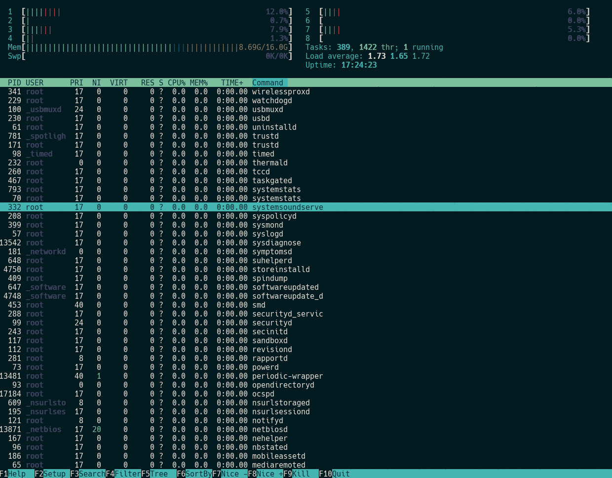
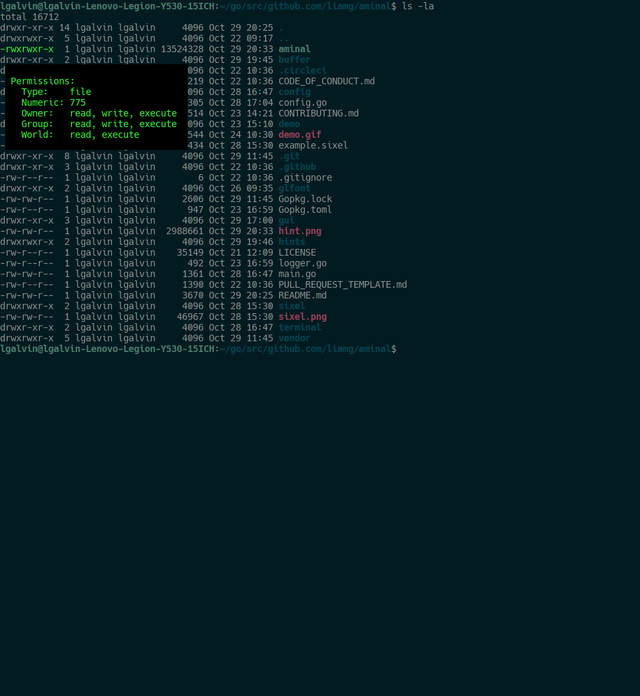
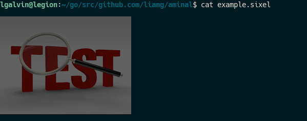

# Aminal - A Modern Terminal Emulator

[](https://circleci.com/gh/liamg/aminal/tree/master)
[](https://goreportcard.com/report/github.com/liamg/aminal)

Aminal is a modern terminal emulator for Mac/Linux implemented in Golang and utilising OpenGL. 



The project is experimental at the moment, so you probably won't want to rely on Aminal as your main terminal for a while.

Ensure you have your latest graphics card drivers installed before use.

## Contextual Hints



## Sixel Support



## Features

- Unicode support
- OpenGL rendering
- Customisation options
- True colour support
- Support for common ANSI escape sequences a la xterm
- Scrollback buffer
- Clipboard access
- Clickable URLs
- Multi platform support (Windows coming soon...)
- Sixel support
- Hints/overlays
- Built-in patched fonts for powerline

## Quick Start

### Installation

#### Prebuilt Binaries

Prebuilt binaries are available for Linux and OSX on the [releases](https://github.com/liamg/aminal/releases) page. 

Download the binary and `sudo cp aminal-* /usr/local/bin/aminal`.

#### Install with Go

```
go get -u https://github.com/liamg/aminal
```

### Build 

#### Dependencies

- On macOS, you need Xcode or Command Line Tools for Xcode (`xcode-select --install`) for required headers and libraries.
- On Ubuntu/Debian-like Linux distributions, you need `libgl1-mesa-dev xorg-dev`.
- On CentOS/Fedora-like Linux distributions, you need `libX11-devel libXcursor-devel libXrandr-devel libXinerama-devel mesa-libGL-devel libXi-devel`.

#### Building Locally

There are various make targets available, the most obvious being:

```
make test
make build
make install
```

As long as you have your `GOBIN` environment variable set up properly (and in `PATH`), you should be able to run `aminal`.

## Keyboard Shortcuts

| Operation            | Key(s)               |
| -------------------- | -------------------- |
| Select text          | click + drag         |
| Select word          | double click         |
| Select line          | triple click         |
| Copy                 | ctrl + shift + c     |
| Toggle debug display | ctrl + shift + d     |
| Paste                | ctrl + shift + v     |
| Google selected text | ctrl + shift + g     |
| Report bug in aminal | ctrl + shift + r     |
| Toggle slomo         | ctrl + shift + ;     |

## Configuration

Aminal looks for a config file in `~/.aminal.toml`, and will write one there the first time it runs, if it doesn't already exist.

You can ignore the config and use defaults by specifying `--ignore-config` as a CLI flag.

### Config Options/CLI Flags

| CLI Flag        | Config Section | Config Name | Type    | Default      | Description                                                                                                                   |
| --------------- | -------------- | ----------- | ------- | ------------ | ----------------------------------------------------------------------------------------------------------------------------- |
| --debug         | _root_         | debug       | boolean | false        | Enable debug mode, with debug logging and debug info terminal overlay.                                                        |
| --slomo         | _root_         | slomo       | boolean | false        | Enable slomo mode, delay the handling of each incoming byte (or escape sequence) from the pty by 100ms. Useful for debugging. |
| --shell [shell] | _root_         | shell       | string  | User's shell | Use the specified shell program instead of the user's usual one.                                                              |
